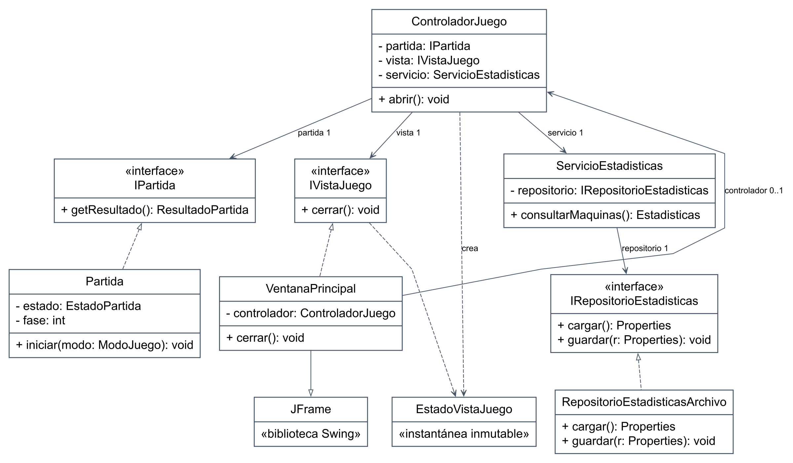
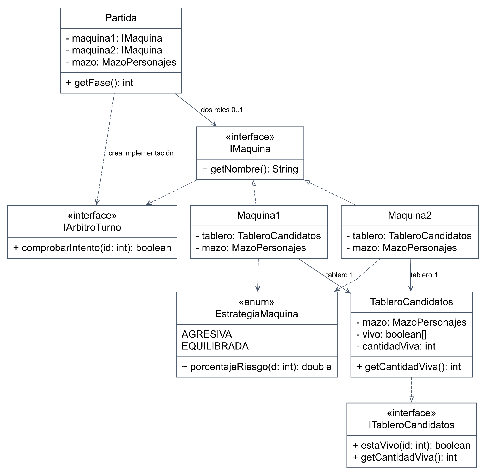
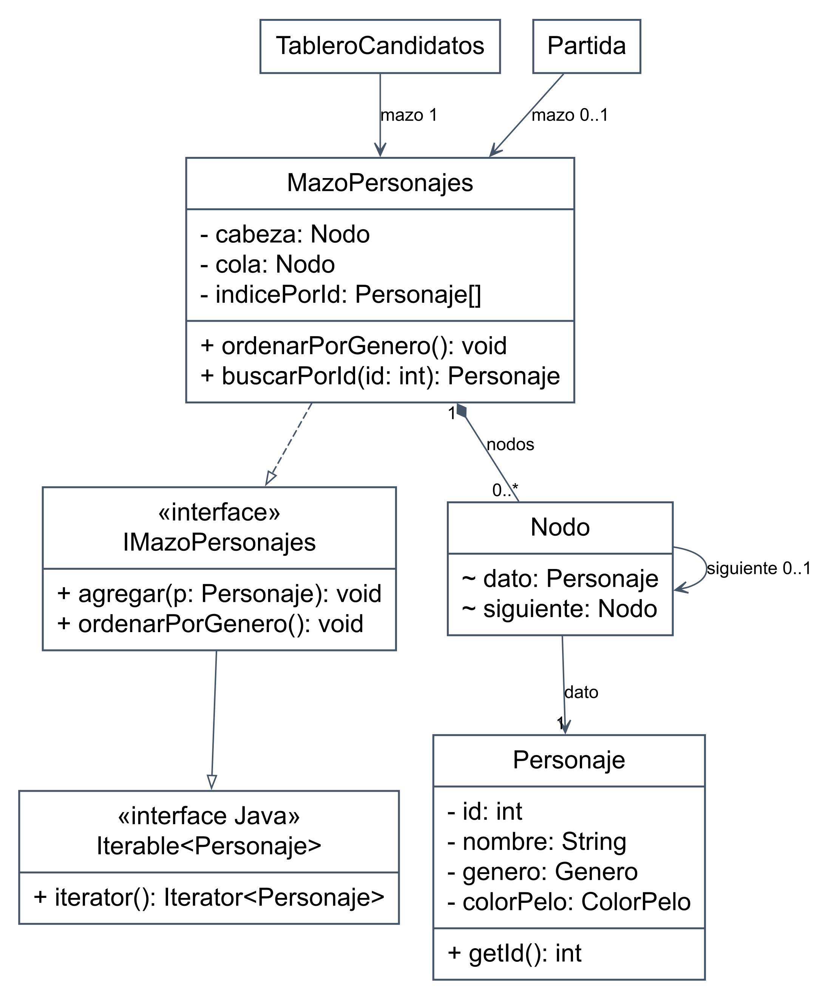
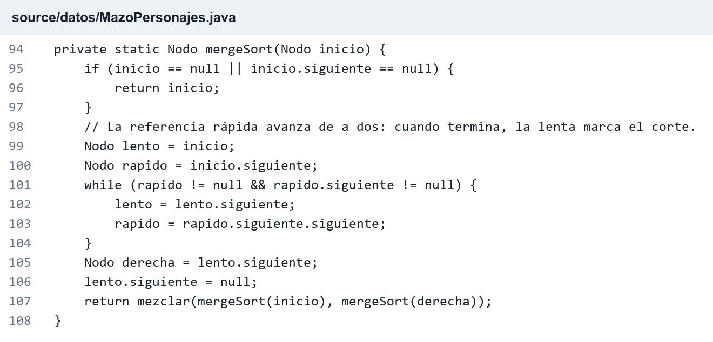
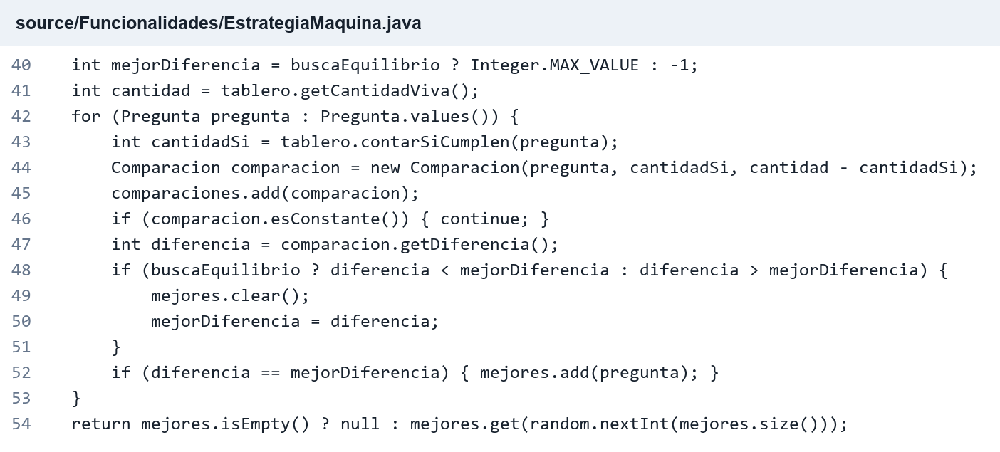

# Informe técnico de Adivina Quién

**Asignatura:** Diseño y Análisis de Algoritmos. **Docente:** López Juan Ignacio.

**Integrantes:** Bruno Ramos, Camila Barral, Emmanuel Strah y Juan Bogado.

**Estado:** contenido técnico para revisión. Los aportes individuales y la reflexión personal quedan para completar por el equipo.

## 1 Introducción y modelo de datos

El proyecto implementa en Java un juego de deducción con Swing y consola opcional. Permite enfrentar al humano con dos máquinas de comportamiento diferente y observar una partida entre máquinas con su razonamiento. Selecciona 23 personajes de un catálogo de 36, conserva sus ID y utiliza el mismo mazo durante ambas fases.

Las estrategias centrales son **Divide y Conquista**, mediante MergeSort para ordenar por género, y **Greedy**, para elegir preguntas según los candidatos restantes. MergeSort garantiza estabilidad y tiempo O(n log n). Greedy evalúa el turno en O(p·n), sin garantizar el menor número total de preguntas ni una victoria.

El motor concentra reglas, turnos y validaciones; la presentación solicita acciones y muestra resultados. Un servicio independiente registra estadísticas por UUID. Esta separación permite probar el juego sin depender de la ventana.

El **catálogo** contiene todos los perfiles; el **mazo**, los 23 elegidos; cada **tablero**, los candidatos vivos de un participante. Descartar no elimina personajes del mazo.

| Estructura | Uso y justificación |
|---|---|
| Lista simplemente enlazada propia | `MazoPersonajes` y `Nodo`: agregado por cola y ordenamiento mediante reenlace de nodos. |
| Arreglos indexados | Búsqueda por ID en O(1), detección de combinaciones duplicadas y marcas de candidatos vivos. |
| `List` y `ArrayList` | Candidatos para sorteos, empates, diagnósticos e historial con orden de recorrido. |
| `Set` y `EnumSet` | Preguntas humanas realizadas sin repetidos; consultas mediante copias inmutables. |
| `Properties` | Registro de claves UUID y valores textuales. El acceso a personajes no usa un `Map`, sino un arreglo por ID. |

Los paquetes `datos` y `defaults` contienen entidades y catálogo; `Funcionalidades`, reglas y estrategias; `Interfaces`, contratos; `Controladores`, coordinación de Swing; `GUI`, componentes; y `main`, el arranque. Pruebas y experimentos se mantienen separados.

<!-- pagina -->

## 2 UML de clases de la aplicación



**Figura 1.** Presentación y persistencia. Los diagramas muestran una selección de clases y miembros; omiten componentes secundarios, sobrecargas y accesores. `+` indica público, `-` privado y `~` visibilidad de paquete. Línea continua con punta abierta: asociación navegable. Discontinua con punta abierta: dependencia. Discontinua con triángulo vacío: implementación de interfaz. Continua con triángulo vacío: herencia de clase. El rombo negro indica composición.

El controlador coordina el motor, la vista y la persistencia mediante sus contratos. `Main` construye y conecta los objetos. La consola utiliza `PartidaConsola` sobre el mismo motor.

<!-- pagina -->

## 3 UML de clases del motor



**Figura 2.** Motor, contratos de máquina y políticas.

Cada máquina copia el tablero recibido y comparte el mazo. El motor crea un árbitro por turno para responder consultas sin entregar el secreto. La **herencia de candidatos** entre fases consiste en copiar los descartes: `Maquina2` no extiende `Maquina1`.

<!-- pagina -->

## Detalle UML del mazo



**Figura 3.** Mazo, nodos y personajes.

El mazo administra sus nodos mediante composición; los personajes se comparten entre catálogo, mazo y consultas. La lista y el índice por ID referencian los mismos personajes, mientras cada tablero mantiene sus propias marcas de descarte. El ordenamiento modifica los enlaces sin cambiar los personajes.

<!-- pagina -->

## 4 Divide y Conquista en MergeSort

`CatalogoPersonajes.crearMazo` mezcla referencias con Fisher–Yates, toma 23 sin repetición, las agrega al final y llama a `ordenarPorGenero`. Fisher–Yates cuesta O(c); la selección aleatoria no reemplaza el ordenamiento por género.

MergeSort divide la lista por el punto medio, resuelve cada mitad recursivamente y las mezcla. La lista vacía o unitaria es el caso base. La figura 4 del Anexo A muestra el método `MazoPersonajes.mergeSort`.

El corte y la mezcla cuestan O(n), de modo que T(n) = T(⌊n/2⌋) + T(⌈n/2⌉) + O(n) = O(n log n). La mezcla es iterativa y la recursión consume O(log n) de pila. Se reutilizan nodos sin crear arreglos auxiliares de personajes.

El criterio es `Genero.getOrden()`. En la mezcla, `<=` elige el nodo izquierdo ante géneros iguales y conserva el orden relativo previo: esa es la estabilidad. No cambian ID, atributos, referencias ni búsquedas. Al terminar se restablece la cola en O(n).

### Elección frente a QuickSort

MergeSort se adapta al acceso secuencial y garantiza O(n log n). QuickSort puede alcanzar O(n²) con particiones desfavorables y su versión habitual no es estable. Con dos géneros sería posible una partición estable lineal, pero no es el algoritmo elegido para demostrar Divide y Conquista.

La consigna original mencionaba orden incremental. El proyecto sustituyó esa inserción por agregado al final y ordenamiento explícito para evitar ordenar dos veces. Por tanto, `agregar` no mantiene el orden: se ordena al finalizar la carga, antes de jugar. Los iteradores anteriores a un cambio estructural no deben reutilizarse.

<!-- pagina -->

## 5 Greedy en las máquinas

Para cada pregunta q se cuentan **s** candidatos que cumplen el atributo y **t = v − s** que no lo cumplen, con v candidatos vivos. Se ignoran las preguntas constantes, s = 0 o t = 0. La evaluación es **D(q) = |s − t|**, calculada sobre el tablero actual sin consultar el secreto.

| Política | Criterio local | Efecto |
|---|---|---|
| Máquina 1 agresiva | Maximizar D entre preguntas útiles | Una respuesta descarta mucho y la otra poco. |
| Máquina 2 equilibrada | Minimizar D entre preguntas útiles | Minimiza el mayor grupo restante del próximo paso. |

Se sortea entre preguntas empatadas. Es Greedy porque elige la mejor evaluación local sin explorar las secuencias posteriores. La figura 5 del Anexo A muestra la selección y el desempate en `EstrategiaMaquina.seleccionarPregunta`.

Con candidatos equiprobables, la cantidad esperada de candidatos restantes es (s² + t²)/v: 4 con una partición 4/4 y 6,25 con una 1/7. La política equilibrada minimiza ese valor inmediato.

### Riesgo y condición de intento

Antes de preguntar, con más de un candidato, se sortea si arriesgar. La probabilidad es min(100, 4 + k·d) por ciento, con d descartes respecto del mazo original y k = 5 para Máquina 1 o 2,5 para Máquina 2. También cuentan los descartes heredados.

El candidato se elige uniformemente entre los vivos. Con uno solo se intenta directamente; si no hay pregunta útil también se intenta. Preguntar consume el turno aunque deje un único candidato. La probabilidad de arriesgar no equivale a la probabilidad de acertar: modela el comportamiento de cada rival.

### Límite global y contraejemplo

El programa conserva los candidatos vivos y recalcula las preguntas posibles en cada turno; no construye un árbol completo. Como cada respuesta cambia qué atributos separan a los perfiles restantes, una buena partición local no garantiza el menor promedio total de preguntas.

#### Contraejemplo con personajes reales del catálogo

Consideremos estos ocho perfiles como candidatos equiprobables y preguntemos hasta identificarlos, sin intentos anticipados ni rival. Es un ejemplo ilustrativo, no una partida observada ni una frecuencia empírica.

| ID y nombre | Género | Pelo | Lentes | Barba | Falta diente |
|---|---|---|---|---|---|
| 3 Catalina | F | Negro | Sí | No | No |
| 5 Agustina | F | Negro | No | No | No |
| 7 Clara | F | Rubio | Sí | No | Sí |
| 15 Pilar | F | Pelado | Sí | Sí | Sí |
| 16 Mía | F | Pelado | Sí | No | No |
| 18 Alma | F | Pelado | No | No | No |
| 20 Mateo | M | Negro | Sí | No | No |
| 33 Joaquín | M | Pelado | Sí | No | No |

La única partición 4/4 es «Es pelado». En cada grupo restante, las preguntas útiles separan 1/3; las profundidades mínimas son 1, 2, 3 y 3. Con la pregunta inicial, la suma es 8 + 9 + 9 = 26: **3,25 preguntas promedio**.

«Tiene el pelo negro» divide 3/5. Género y lentes resuelven el grupo de tres con suma de profundidades 5. En el de cinco, «Le falta un diente» separa a Clara y Pilar; «Es pelado» las distingue, y género y lentes resuelven el otro grupo de tres. La suma interna es 5 + 2 + 5 = 12. Total: 8 + 5 + 12 = 25, es decir, **3,125 preguntas promedio**.

El árbol que empieza por pelo negro requiere menos preguntas en promedio (3,125 frente a 3,25), aunque ambos pueden necesitar hasta cuatro. Sumar un intento final a ambos mantiene la diferencia; el ejemplo no compara victorias.

<!-- pagina -->

## 6 Descartes y validaciones

El tablero descarta únicamente candidatos vivos incompatibles con la respuesta. Fragmento real de `TableroCandidatos.descartarSegun`:

```java
for (Personaje p : mazo) {
    if (vivo[p.getId()] && pregunta.cumple(p) != respuesta) {
        vivo[p.getId()] = false;
        cantidadViva--;
        descartados++;
    }
}
```

El filtro cuesta O(n): recorre el mazo completo y consulta `vivo`, incluso si quedan pocos candidatos. Con respuestas consistentes, el secreto permanece vivo. Un intento fallido marca solo un ID en O(1).

La máquina no recibe el personaje objetivo. `Partida` crea un objeto `IArbitroTurno` para responder una pregunta y comprobar un ID. El árbitro conserva internamente la referencia, pero el contrato no ofrece un getter del secreto. La vista humana solo puede revelar el rival al finalizar; espectador permite ver ambos secretos.

El motor exige estado y turno correctos antes de modificar datos. Rechaza preguntas nulas o repetidas, ID ausentes y candidatos descartados sin consumir el turno. El mazo valida capacidad, ID positivo, ID único y combinación de atributos única. Las consultas de candidatos y preguntas son copias inmutables.

La versión implementada prohíbe repetir preguntas humanas dentro de una fase, como decisión del proyecto respecto de la consigna inicial. Las máquinas recalculan preguntas útiles: una ya respondida pasa a ser constante en los sobrevivientes. La variedad de atributos permite distinguir los perfiles del catálogo.

### Segunda fase y finalización

Si el humano gana y el rival descartó menos de 15 personajes, puede enfrentar a la otra máquina. Con 15 o más se registra victoria directamente. Al aceptar se conservan UUID, mazo y secreto humano; la nueva máquina copia el tablero anterior y elige un secreto diferente del anterior. El humano reinicia con 22 candidatos; se reinician preguntas y ronda. Funciona con cualquiera de los dos órdenes de rivales.

Acertar finaliza el enfrentamiento. Ganar ambas fases produce victoria verdadera; perder cualquiera, derrota final. Rechazar el desafío produce victoria. Mientras la decisión está pendiente no existe resultado definitivo. Una partida completa cuenta una sola vez y abandonar no produce un resultado registrable.

<!-- pagina -->

## 7 Patrones de diseño y contratos

Divide y Conquista y Greedy son estrategias algorítmicas. Los siguientes patrones y decisiones organizan el software que las utiliza.

### Modelo Vista Controlador

`Partida`, tableros y estrategias resuelven reglas; `ControladorJuego` coordina eventos y guardado; `VentanaPrincipal` presenta instantáneas. El controlador delega la pregunta al motor:

```java
public void preguntar(Pregunta pregunta) {
    if (turnoHumano()) { resolverAccion(() -> partida.preguntar(pregunta)); }
}
```

La vista no calcula descartes ni probabilidades. `resolverAccion` registra el resultado o comunica el error y luego se actualiza la presentación. MVC permite reutilizar el motor desde consola, donde `PartidaConsola` reúne vista y controlador.

### Estrategias polimórficas

`Partida` invoca `IMaquina.ejecutarTurno`. Ambas máquinas implementan el contrato y delegan en el enum de políticas. Por ejemplo, Máquina 1:

```java
public ResultadoTurno ejecutarTurno(IArbitroTurno arbitro) {
    return EstrategiaMaquina.AGRESIVA.ejecutarTurno(nombre, mazo, tablero, random, arbitro);
}
```

La idea de Strategy aparece en comportamientos intercambiables por contrato. La implementación concreta comparte un enum parametrizado: no utiliza una jerarquía independiente de clases para cada fórmula ni configuración arbitraria de estrategias en ejecución.

### Iterator y frontera de persistencia

`IMazoPersonajes` extiende `Iterable<Personaje>`. El iterador de `MazoPersonajes` avanza desde `cabeza`; el `for (Personaje p : mazo)` usado para filtrar no expone nodos. No se implementa detección de modificación concurrente.

`ServicioEstadisticas` recibe `IRepositorioEstadisticas` por constructor. Separa contabilización y disco y permite repositorios en memoria para pruebas. Es una frontera de persistencia y un ejemplo de inversión de dependencias, aunque el contrato expone `Properties`, por lo que no es independiente del formato a nivel de tipos. No se atribuyen Singleton, Observer propio o Factory Method por el solo hecho de usar interfaces o métodos de creación.

<!-- pagina -->

## 8 Notación Big O

Sean n los personajes del mazo, c los del catálogo, m el mayor ID, p las preguntas, h las acciones del historial, r los registros persistidos y L la cantidad total de texto del registro. Hoy n = 23, c = 36 y p = 9. Las cotas expresan cómo crecerían las operaciones al variar esos tamaños.

| Operación | Tiempo | Espacio adicional |
|---|---|---|
| Enlazar por cola | O(1) | O(1) por nodo |
| Ampliar índice por ID | O(m) por ampliación | O(m) para el índice |
| Buscar o descartar un ID | O(1) | O(1) |
| Fisher–Yates | O(c) | O(c) en referencias |
| MergeSort | O(n log n) | O(log n) de pila |
| Restablecer cola | O(n) | O(1) |
| Resolver un filtro | O(n) | O(1) |
| Evaluar preguntas de máquina | O(p·n) | O(p) en diagnóstico y empates |
| Elegir candidato aleatorio | O(n) | O(n) en referencias |
| Copiar tablero | O(m) | O(m) |
| Preparar segunda fase completa | O(n + m) | O(n + m) |
| Consultar candidatos como copia | O(n) | O(n) |
| Construir instantánea de vista | O(n + p + h) | O(n + p + h) |
| Preparar datos de presentación y texto del historial | O(n + h·p) | O(n + h·p) |
| Cargar, validar y consultar estadísticas | O(r + L) | O(r + L) |
| Registrar una partida nueva y guardar el archivo completo | O(r log r + L) | O(r + L) |

El enlace por cola cuesta O(1), pero `agregar` puede ampliar el índice en O(m). Con ID consecutivos, esas ampliaciones acumulan O(c²) al construir el catálogo.

Las consultas de estadísticas cargan y recorren el registro completo. Registrar una partida nueva reescribe el archivo; en el JDK 25 utilizado, `Properties.store` ordena las claves antes de escribirlas. Si los registros tienen longitud acotada, las cotas se simplifican a O(r) para consultar y O(r log r) para registrar. Los accesos mediante hash consideran su costo esperado.

Para h acciones del motor, una cota simple es O(h·p·n), además de la inicialización. Decidir un turno y preparar el historial son costos distintos: reconstruirlo después de cada acción puede acumular O(h·n + p·h²). La fila de presentación supone textos de longitud acotada y excluye el renderizado de imágenes y las pausas. No hay una única Big O para todo el juego, ni corresponde llamarlo O(log n) por una partición ideal de candidatos.

<!-- pagina -->

## 9 Comparación experimental y alternativas

El 17/09/2026 se comparó el MergeSort real con Inserción estable sobre listas enlazadas del mismo tipo. Cada par recibió los mismos 23 personajes en idéntico orden y con nodos independientes. Son mediciones históricas conservadas, no ejecuciones nuevas de esta edición.

| Entrada de 23 personajes | MergeSort en ms | Inserción en ms |
|---|---:|---:|
| Mezclada | 0.000630920 | 0.000453800 |
| Ordenada por género | 0.000479040 | 0.000482370 |
| Invertida por género | 0.000541280 | 0.000272445 |

Los valores son medianas de 30 promedios por tanda de 10.000 ordenamientos, tras 15 tandas de calentamiento por escenario. Se usaron 100 semillas y alternancia del algoritmo medido primero. Se excluyeron preparación y verificaciones; se incluyó restablecer la cola. Se conservaron 180 mediciones.

El entorno registrado fue Windows 11, Intel Core i9-14900HX, OpenJDK 25.0.4 y heap de 256 MB. Se verificaron 2.700.000 resultados de listas contando calentamiento y medición. El protocolo, rangos y reproducción están en `docs/experiments/README.md`; el CSV está en esa misma carpeta.

En entrada mezclada, Inserción tuvo una mediana inferior por 0.000177120 ms, aproximadamente 0,177 microsegundos. Para ordenar una lista al iniciar, esa magnitud no tiene relevancia práctica perceptible. Con n = 23 importan las constantes y solo existen dos claves de género. Invertirlas no equivale a invertir 23 claves distintas ni garantiza el peor caso de Inserción.

No se afirma significación estadística ni superioridad universal: hubo variación y se utilizó una sola JVM. MergeSort conserva estabilidad, adecuación a la lista y crecimiento O(n log n). Big O no predice qué implementación gana para toda entrada pequeña.

### Algoritmos no utilizados en el motor

QuickSort se descartó por su peor caso y estabilidad, explicados antes. Inserción quedó como referencia experimental: su peor caso O(n²) y el doble trabajo de insertar ordenado y luego ordenar no justifican usarla además de MergeSort. Burbujeo tampoco aporta una ventaja para este mazo.

La búsqueda binaria no corresponde al filtrado de atributos ni al acceso por ID: se ordena por género, la lista no ofrece acceso posicional constante y el índice por ID ya es O(1). No se explora el árbol completo ni se usa programación dinámica en el juego.

<!-- pagina -->

## 10 Persistencia e interfaz

`ResultadoPartida` conserva UUID, modo y desenlace. El servicio registra una entrada por partida y deriva los contadores; el marcador de máquinas es independiente.

Los nombres se recortan y se comparan sin distinguir mayúsculas o minúsculas, pero los acentos sí se distinguen. No hay autenticación. Un UUID idéntico con iguales datos no suma; un registro contradictorio se rechaza.

`RepositorioEstadisticasArchivo` utiliza `data/estadisticas.properties` en UTF-8 y guarda mediante temporal y reemplazo atómico. ServicioEstadisticas valida versión y contenido. Ante datos inválidos o error, informa la causa y permite reintentar. No coordina procesos concurrentes ni recupera partidas incompletas.

`UsuarioArchivo` recuerda el nombre en `data/usuario.txt`, incluso al editar y cerrar sin jugar. Se guarda al cierre normal, no ante una terminación forzada. La consola produce el resultado, pero no guarda automáticamente las estadísticas.

### Interfaz Swing

`Main` abre Swing en el hilo de eventos y admite `--consola`. La interfaz ofrece partidas humanas y modo espectador, que muestra ambas máquinas y permite pausar o avanzar turnos.

Un `Timer` regula la pausa entre turnos de máquina y el guardado se procesa fuera del hilo gráfico. Las respuestas obsoletas se descartan al cancelar una consulta o cambiar la sesión, para no actualizar una partida que ya cambió.

La vista recibe copias inmutables y diagnósticos ya calculados, para mostrar el fundamento sin volver a sortear la pregunta.


<!-- pagina -->

## 11 Verificación

La verificación registrada el 13/09/2026 completó la compilación compatible con Java 17, en UTF-8 y sin errores ni advertencias, y aprobó los 14 programas de regresión. La ejecución se realizó con JDK 25; no se comprobó en una JVM 17.

Las pruebas cubrieron ordenamiento e identidad de personajes, estrategias y protección de secretos, validación de entradas, transiciones entre fases, resultados y persistencia. También comprobaron reintentos, prevención de duplicados, cancelación de turnos, respuestas tardías y flujos de Swing.

Las capturas históricas de la interfaz se conservan en `docs/figures/` y proceden de pruebas de componentes reales con datos controlados; no acreditan una prueba manual prolongada. El experimento del 17/09/2026 tiene su protocolo y verificación en `docs/experiments/README.md`. Estos resultados corresponden a las ejecuciones registradas, no a nuevas pruebas realizadas durante la edición del informe.

<!-- pagina -->

## 12 Participación y reflexión

| Integrante | Aportes y tareas | Dificultades y resolución |
|---|---|---|
| Bruno Ramos | [Completar por el equipo] | [Completar por el equipo] |
| Camila Barral | [Completar por el equipo] | [Completar por el equipo] |
| Emmanuel Strah | [Completar por el equipo] | [Completar por el equipo] |
| Juan Bogado | [Completar por el equipo] | [Completar por el equipo] |

**Reflexión personal y grupal:** [Completar con aprendizajes, dificultades propias y valoración del trabajo compartido].

El balance técnico es un juego con ordenamiento estable, dos políticas explicables, secreto protegido y motor reutilizable. Las pruebas reproducen límites y los diagnósticos permiten observar decisiones. El experimento muestra por qué una mejor cota asintótica no implica menor tiempo con 23 elementos.

Las dificultades registradas incluyen doble ordenamiento, mezcla de interacción y reglas, conservación de candidatos y eventos o guardados tardíos. Se resolvieron con ordenamiento explícito, motor por acciones, copias de tableros y controles de sesión. Estos hechos no sustituyen la reflexión de los integrantes.

Las mejoras posibles incluyen crecimiento más eficiente del índice, actualización incremental del historial y políticas con anticipación de más de un paso. Son propuestas, no funcionalidades implementadas; deben valorarse según la escala del juego.

### Bibliografía y fuentes

1. López, Juan Ignacio. **Documentación para primer TP Programación III.pdf**, páginas 1 y 2. Consigna suministrada: UML, algoritmos, complejidad y comparación experimental.
2. **Consigna original TP.docx** y **Borrador de diseño.docx**. Modalidades, atributos, riesgo, herencia de candidatos y resultados. Las pistas opcionales del borrador no se presentan como implementadas.
3. **Código fuente del repositorio**, especialmente `MazoPersonajes`, `CatalogoPersonajes`, `EstrategiaMaquina`, `TableroCandidatos`, `Partida`, `ControladorJuego` y `ServicioEstadisticas`. Fuente de los fragmentos y relaciones.
4. **README.md**, **docs/experiments/README.md** y CSV del 17/09/2026. Instrucciones, decisiones, pruebas y mediciones.

### Herramientas y asistencia

Se utilizaron Java, Swing, Git, PowerShell y herramientas de edición y verificación. Se utilizó asistencia de IA mediante Codex para implementar, probar y documentar el proyecto. Esta edición también usó Codex para contrastar fuentes, preparar UML, verificar el contraejemplo y redactar, y Python para generar documentos. Las mediciones se tomaron del experimento registrado. La revisión y defensa corresponde al equipo.

<!-- pagina -->

## Anexo A Fragmentos de código

Imágenes generadas a partir del código real, con archivo y líneas, como evidencia visual de las estrategias. Sus explicaciones y cotas están en los apartados 4 y 5.



**Figura 4.** División recursiva de la lista y llamada al método de mezcla. Tiempo O(n log n) y pila O(log n).



**Figura 5.** Evaluación de preguntas y empates. Tiempo O(p·n), espacio O(p) para diagnóstico y empates.
