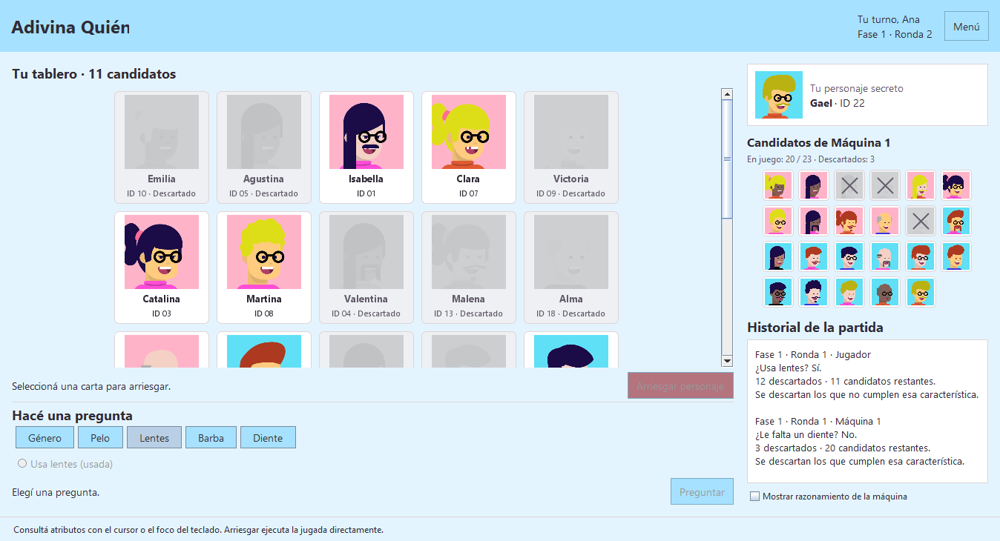
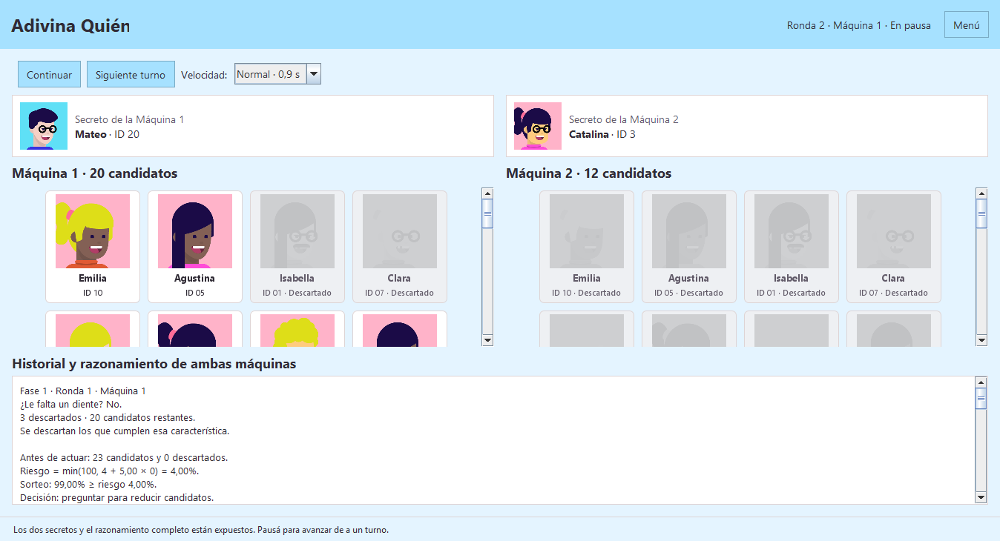

# Informe técnico de Adivina Quién

**Asignatura:** Diseño y Análisis de Algoritmos. **Docente:** López Juan Ignacio.

**Integrantes:** Bruno Ramos, Camila Barral, Emmanuel Strah y Juan Bogado.

**Estado:** contenido técnico para revisión. Los aportes individuales y la reflexión personal quedan para completar por el equipo.

## 1 Introducción y modelo de datos

El proyecto implementa en Java un juego de deducción con Swing y consola opcional. Permite enfrentar al humano con dos máquinas de comportamiento diferente y observar una partida entre máquinas con su razonamiento. Selecciona 23 personajes de un catálogo de 36, conserva sus ID y utiliza el mismo mazo durante ambas fases.

Las estrategias centrales son **Divide y Conquista**, mediante MergeSort para ordenar por género, y **Greedy**, para elegir preguntas según los candidatos restantes. MergeSort garantiza estabilidad y tiempo O(n log n). Greedy evalúa el turno en O(p·n), sin garantizar el menor número total de preguntas ni una victoria.

El motor concentra reglas, turnos y validaciones; la presentación solicita acciones y muestra resultados. Un servicio independiente registra estadísticas por UUID. Esta separación permite probar el juego sin depender de la ventana.

El **catálogo** contiene todos los perfiles; el **mazo**, los 23 elegidos; cada **tablero**, los candidatos vivos de un participante. Descartar no elimina personajes del mazo.

| Estructura | Uso y justificación |
|---|---|
| Lista simplemente enlazada propia | `MazoPersonajes` y `Nodo`: agregado por cola y ordenamiento mediante reenlace de nodos. |
| Arreglos indexados | Búsqueda por ID en O(1), detección de combinaciones duplicadas y marcas de candidatos vivos. |
| `List` y `ArrayList` | Candidatos para sorteos, empates, diagnósticos e historial con orden de recorrido. |
| `Set` y `EnumSet` | Preguntas humanas realizadas sin repetidos; consultas mediante copias inmutables. |
| `Properties` | Registro de claves UUID y valores textuales. El acceso a personajes no usa un `Map`, sino un arreglo por ID. |

Los paquetes `datos` y `defaults` contienen entidades y catálogo; `Funcionalidades`, reglas y estrategias; `Interfaces`, contratos; `Controladores`, coordinación de Swing; `GUI`, componentes; y `main`, el arranque. Pruebas y experimentos se mantienen separados.

<!-- pagina -->

## 2 UML de clases de la aplicación


**Figura 1.** Clases principales de presentación y persistencia, con miembros seleccionados. `+` indica público, `-` privado y `~` visibilidad de paquete. Línea continua con punta abierta: asociación navegable. Discontinua con punta abierta: dependencia. Discontinua con triángulo vacío: implementación de interfaz. Continua con triángulo vacío: herencia de clase.

`ControladorJuego` mantiene referencias a `IPartida`, `IVistaJuego` y `ServicioEstadisticas`. `VentanaPrincipal` implementa la vista y hereda de `JFrame`; conserva una referencia al controlador para entregar eventos. `EstadoVistaJuego` transporta la instantánea presentada. El servicio depende del contrato de repositorio, implementado por el archivo.

`Main` construye y conecta los objetos. Los paneles de cartas, preguntas, secretos e historial se omiten para mantener la vista legible. La consola utiliza `PartidaConsola`, que reúne interacción y presentación sobre `IPartida`.

El diagrama representa clases y relaciones, no un flujo de pantallas. Los archivos editables están en `docs/uml/`; el motor y sus estructuras se amplían en la figura siguiente.

<!-- pagina -->

## 3 UML de clases del motor


**Figura 2.** El motor, los contratos de máquina y las políticas. Los miembros mostrados son una selección de las declaraciones reales.

`Partida` implementa `IPartida` y conserva referencias `IMaquina`. Ambas máquinas implementan ese contrato y delegan su política en `EstrategiaMaquina`. Cada una copia el tablero recibido y comparte el mazo. El motor crea un árbitro por turno para responder consultas sin entregar el secreto.

`TableroCandidatos` implementa `ITableroCandidatos`. Se omiten sobrecargas, getters repetidos y enumeraciones auxiliares. `ResultadoTurno` y `DiagnosticoTurno` conservan la acción y su fundamento; `ResultadoPartida`, el desenlace definitivo.

La **herencia de candidatos** entre fases es una copia del estado de descarte, no herencia de clases Java: `Maquina2` no extiende `Maquina1`.

<!-- pagina -->

## Detalle UML del mazo


**Figura 3.** El rombo negro representa composición: el mazo administra sus nodos. Cada nodo referencia exactamente un personaje y cero o un siguiente. La relación con personaje no es composición porque los objetos se comparten entre catálogo, mazo y consultas.

`MazoPersonajes` implementa `IMazoPersonajes`, que extiende `Iterable<Personaje>`. `~` indica visibilidad de paquete: los nodos no son públicos. El mazo mantiene cabeza y cola y reordena enlaces, sin cambiar los personajes.

El arreglo por ID y la lista son dos accesos a los mismos personajes. Cada tablero conserva una referencia al mazo y un arreglo independiente de marcas de candidatos. Por eso dos participantes pueden descartar de forma diferente sin cambiar el orden ni los atributos del mazo compartido.

<!-- pagina -->

## 4 Divide y Conquista en MergeSort

`CatalogoPersonajes.crearMazo` mezcla referencias con Fisher–Yates, toma 23 sin repetición, las agrega al final y llama a `ordenarPorGenero`. Fisher–Yates cuesta O(c); la selección aleatoria no reemplaza el ordenamiento por género.

MergeSort divide la lista por el punto medio, resuelve cada mitad recursivamente y las mezcla. La lista vacía o unitaria es el caso base. Este es el método real de `MazoPersonajes`:

```java
private static Nodo mergeSort(Nodo inicio) {
    if (inicio == null || inicio.siguiente == null) {
        return inicio;
    }
    // La referencia rápida avanza de a dos: cuando termina, la lenta marca el corte.
    Nodo lento = inicio;
    Nodo rapido = inicio.siguiente;
    while (rapido != null && rapido.siguiente != null) {
        lento = lento.siguiente;
        rapido = rapido.siguiente.siguiente;
    }
    Nodo derecha = lento.siguiente;
    lento.siguiente = null;
    return mezclar(mergeSort(inicio), mergeSort(derecha));
}
```

El corte y la mezcla cuestan O(n), de modo que T(n) = T(⌊n/2⌋) + T(⌈n/2⌉) + O(n) = O(n log n). La mezcla es iterativa y la recursión consume O(log n) de pila. Se reutilizan nodos sin crear arreglos auxiliares de personajes.

El criterio es `Genero.getOrden()`. En la mezcla, `<=` elige el nodo izquierdo ante géneros iguales y conserva el orden relativo previo: esa es la estabilidad. No cambian ID, atributos, referencias ni búsquedas. Al terminar se restablece la cola en O(n).

### Elección frente a QuickSort

MergeSort se adapta al acceso secuencial y garantiza O(n log n). QuickSort puede alcanzar O(n²) con particiones desfavorables y su versión habitual no es estable. Con dos géneros sería posible una partición estable lineal, pero no es el algoritmo elegido para demostrar Divide y Conquista.

La consigna original mencionaba orden incremental. El proyecto sustituyó esa inserción por agregado al final y ordenamiento explícito para evitar ordenar dos veces. Por tanto, `agregar` no mantiene el orden: se ordena al finalizar la carga, antes de jugar. Los iteradores anteriores a un cambio estructural no deben reutilizarse.

<!-- pagina -->

## 5 Greedy en la selección de preguntas

Para cada pregunta q se cuentan **s** candidatos que cumplen el atributo y **t = v − s** que no lo cumplen, con v candidatos vivos. Se ignoran las preguntas constantes, s = 0 o t = 0. La evaluación es **D(q) = |s − t|**, calculada sobre el tablero actual sin consultar el secreto.

| Política | Criterio local | Efecto |
|---|---|---|
| Máquina 1 agresiva | Maximizar D entre preguntas útiles | Una respuesta descarta mucho y la otra poco. |
| Máquina 2 equilibrada | Minimizar D entre preguntas útiles | Minimiza el mayor grupo restante del próximo paso. |

Se sortea entre preguntas empatadas. Es Greedy porque elige la mejor evaluación local sin explorar las secuencias posteriores. Fragmento real de `EstrategiaMaquina.seleccionarPregunta`:

```java
if (comparacion.esConstante()) { continue; }
int diferencia = comparacion.getDiferencia();
if (buscaEquilibrio ? diferencia < mejorDiferencia : diferencia > mejorDiferencia) {
    mejores.clear();
    mejorDiferencia = diferencia;
}
if (diferencia == mejorDiferencia) { mejores.add(pregunta); }
```

Con 8 candidatos, una partición 4/4 elimina siempre 4. Una 1/7 elimina 7 si el secreto está en el grupo de uno, pero solo 1 en el otro caso. Para candidatos equiprobables, la cantidad esperada restante es (s² + t²)/v: 4 frente a 6,25. Equilibrar minimiza también el promedio del siguiente paso bajo esa hipótesis; no se usa una distribución aprendida de elecciones humanas.

### Riesgo y condición de intento

Antes de preguntar, con más de un candidato, se sortea si arriesgar. La probabilidad es min(100, 4 + k·d) por ciento, con d descartes respecto del mazo original y k = 5 para Máquina 1 o 2,5 para Máquina 2. Diez descartes producen 54 % y 29 %. También cuentan los descartes heredados.

El candidato se elige uniformemente entre los vivos. Con uno solo se intenta directamente; si no hay pregunta útil también se intenta. Un fallo elimina únicamente ese ID. Preguntar consume el turno aunque deje un único candidato. La probabilidad de arriesgar no equivale a la probabilidad de acertar: modela el comportamiento de cada rival.

<!-- pagina -->

## 6 Por qué Greedy puede no ser óptimo

El árbol de decisión es una interpretación de las preguntas sí/no. El programa conserva candidatos, no un árbol completo. Los atributos están relacionados por los perfiles disponibles: un filtro cambia la utilidad de los restantes. No corresponde multiplicar probabilidades suponiendo atributos independientes.

La Máquina 1 puede elegir 1/7 frente a 4/4 y terminar en la rama de siete. Su criterio no minimiza el peor caso inmediato. La Máquina 2 mejora ese criterio local, pero tampoco garantiza el menor número total de preguntas.

### Contraejemplo con personajes reales del catálogo

Considérese este subconjunto ilustrativo. No se presenta como una partida observada ni una frecuencia empírica.

| ID y nombre | Género | Pelo | Lentes | Barba | Falta diente |
|---|---|---|---|---|---|
| 3 Catalina | F | Negro | Sí | No | No |
| 5 Agustina | F | Negro | No | No | No |
| 7 Clara | F | Rubio | Sí | No | Sí |
| 15 Pilar | F | Pelado | Sí | Sí | Sí |
| 16 Mía | F | Pelado | Sí | No | No |
| 18 Alma | F | Pelado | No | No | No |
| 20 Mateo | M | Negro | Sí | No | No |
| 33 Joaquín | M | Pelado | Sí | No | No |

La única partición 4/4 es «Es pelado». En cada grupo restante, las preguntas útiles separan 1/3; las profundidades mínimas son 1, 2, 3 y 3. Con la pregunta inicial, la suma es 8 + 9 + 9 = 26: **3,25 preguntas promedio**.

«Tiene el pelo negro» divide 3/5. Género y lentes resuelven el grupo de tres con suma de profundidades 5. En el de cinco, «Le falta un diente» separa a Clara y Pilar; el color distingue esa pareja, y género y lentes resuelven el otro grupo de tres. La suma interna es 5 + 2 + 5 = 12. Total: 8 + 5 + 12 = 25, es decir, **3,125 preguntas promedio**.

La alternativa menos equilibrada tiene menor costo. Se suponen candidatos equiprobables y preguntas hasta identificar, sin intentos anticipados ni rival. Un intento final suma uno a ambos promedios. El ejemplo refuta la optimalidad global del criterio de preguntas; no mide victorias. `docs/verification/greedy-counterexample.py` verifica particiones y costos mediante enumeración exacta.

<!-- pagina -->

## 7 Descartes y validaciones

El tablero descarta únicamente candidatos vivos incompatibles con la respuesta. Fragmento real de `TableroCandidatos.descartarSegun`:

```java
for (Personaje p : mazo) {
    if (vivo[p.getId()] && pregunta.cumple(p) != respuesta) {
        vivo[p.getId()] = false;
        cantidadViva--;
        descartados++;
    }
}
```

El filtro cuesta O(n): recorre el mazo completo y consulta `vivo`, incluso si quedan pocos candidatos. Con respuestas consistentes, el secreto permanece vivo. Un intento fallido marca solo un ID en O(1).

La máquina no recibe el personaje objetivo. `Partida` crea un objeto `IArbitroTurno` para responder una pregunta y comprobar un ID. El árbitro conserva internamente la referencia, pero el contrato no ofrece un getter del secreto. La vista humana solo puede revelar el rival al finalizar; espectador permite ver ambos secretos.

El motor exige estado y turno correctos antes de modificar datos. Rechaza preguntas nulas o repetidas, ID ausentes y candidatos descartados sin consumir el turno. El mazo valida capacidad, ID positivo, ID único y combinación de atributos única. Las consultas de candidatos y preguntas son copias inmutables.

La versión implementada prohíbe repetir preguntas humanas dentro de una fase, como decisión del proyecto respecto de la consigna inicial. Las máquinas recalculan preguntas útiles: una ya respondida pasa a ser constante en los sobrevivientes. La variedad de atributos permite distinguir los perfiles del catálogo.

### Segunda fase y finalización

Si el humano gana y el rival descartó menos de 15 personajes, puede enfrentar a la otra máquina. Con 15 o más se registra victoria directamente. Al aceptar se conservan UUID, mazo y secreto humano; la nueva máquina copia el tablero anterior y elige un secreto diferente del anterior. El humano reinicia con 22 candidatos; se reinician preguntas y ronda. Funciona con cualquiera de los dos órdenes de rivales.

Acertar finaliza el enfrentamiento. Ganar ambas fases produce victoria verdadera; perder cualquiera, derrota final. Rechazar el desafío produce victoria. Mientras la decisión está pendiente no existe resultado definitivo. Una partida completa cuenta una sola vez y abandonar no produce un resultado registrable.

<!-- pagina -->

## 8 Patrones de diseño y contratos

Divide y Conquista y Greedy son estrategias algorítmicas. Los siguientes patrones y decisiones organizan el software que las utiliza.

### Modelo Vista Controlador

`Partida`, tableros y estrategias resuelven reglas; `ControladorJuego` coordina eventos y guardado; `VentanaPrincipal` presenta instantáneas. El controlador delega la pregunta al motor:

```java
public void preguntar(Pregunta pregunta) {
    if (turnoHumano()) { resolverAccion(() -> partida.preguntar(pregunta)); }
}
```

La vista no calcula descartes ni probabilidades. `resolverAccion` registra el resultado o comunica el error y luego se actualiza la presentación. MVC permite reutilizar el motor desde consola, donde `PartidaConsola` reúne vista y controlador.

### Estrategias polimórficas

`Partida` invoca `IMaquina.ejecutarTurno`. Ambas máquinas implementan el contrato y delegan en el enum de políticas. Por ejemplo, Máquina 1:

```java
public ResultadoTurno ejecutarTurno(IArbitroTurno arbitro) {
    return EstrategiaMaquina.AGRESIVA.ejecutarTurno(nombre, mazo, tablero, random, arbitro);
}
```

La idea de Strategy aparece en comportamientos intercambiables por contrato. La implementación concreta comparte un enum parametrizado: no utiliza una jerarquía independiente de clases para cada fórmula ni configuración arbitraria de estrategias en ejecución.

### Iterator y frontera de persistencia

`IMazoPersonajes` extiende `Iterable<Personaje>`. El iterador de `MazoPersonajes` avanza desde `cabeza`; el `for (Personaje p : mazo)` usado para filtrar no expone nodos. No se implementa detección de modificación concurrente.

`ServicioEstadisticas` recibe `IRepositorioEstadisticas` por constructor. Separa contabilización y disco y permite repositorios en memoria para pruebas. Es una frontera de persistencia y un ejemplo de inversión de dependencias, aunque el contrato expone `Properties`, por lo que no es independiente del formato a nivel de tipos. No se atribuyen Singleton, Observer propio o Factory Method por el solo hecho de usar interfaces o métodos de creación.

<!-- pagina -->

## 9 Notación Big O

Sean n los personajes del mazo, c los del catálogo, m el mayor ID, p las preguntas, h las acciones del historial y r los registros persistidos. Hoy n = 23, c = 36 y p = 9. Las cotas expresan cómo crecerían las operaciones al variar esos tamaños.

| Operación | Tiempo | Espacio adicional |
|---|---|---|
| Enlazar por cola | O(1) | O(1) por nodo |
| Ampliar índice por ID | O(m) por ampliación | O(m) para el índice |
| Buscar o descartar un ID | O(1) | O(1) |
| Fisher–Yates | O(c) | O(c) en referencias |
| MergeSort | O(n log n) | O(log n) de pila |
| Restablecer cola | O(n) | O(1) |
| Resolver un filtro | O(n) | O(1) |
| Evaluar preguntas de máquina | O(p·n) | O(p) en diagnóstico y empates |
| Elegir candidato aleatorio | O(n) | O(n) en referencias |
| Copiar tablero | O(m) | O(m) |
| Preparar segunda fase completa | O(n + m) | O(n + m) |
| Consultar candidatos como copia | O(n) | O(n) |
| Construir instantánea de vista | O(n + p + h) | O(n + p + h) |
| Reconstruir vista e historial | O(n + h·p) | Componentes e imágenes |
| Cargar, consultar o guardar registro | O(r), con registros de tamaño acotado | O(r) |

El enlace por cola es constante, pero `agregar` puede copiar el índice hasta ID + 1. Al construir el catálogo con ID consecutivos, las copias acumuladas llegan a O(c²). Por eso, toda la inicialización no cuesta solamente O(n log n): incluye construcción e índices. Con ID generalizados importa su magnitud m.

No hay una única Big O para ordenamiento, interacción y persistencia. Para h acciones del motor, una cota simple es O(h·p·n), además de inicializar. Excluye tiempo humano, pausas deliberadas y dibujo de imágenes.

El motor devuelve un diagnóstico por turno; el controlador acumula O(h·p) de historial. Reconstruirlo después de cada acción puede acumular O(h·n + p·h²), aunque decidir siga costando O(p·n). No corresponde afirmar que todo el juego es O(log n) porque una pregunta ideal divida los candidatos por la mitad.

<!-- pagina -->

## 10 Comparación experimental y alternativas

El 17/09/2026 se comparó el MergeSort real con Inserción estable sobre listas enlazadas del mismo tipo. Cada par recibió los mismos 23 personajes en idéntico orden y con nodos independientes. Son mediciones históricas conservadas, no ejecuciones nuevas de esta edición.

| Entrada de 23 personajes | MergeSort en ms | Inserción en ms |
|---|---:|---:|
| Mezclada | 0.000630920 | 0.000453800 |
| Ordenada por género | 0.000479040 | 0.000482370 |
| Invertida por género | 0.000541280 | 0.000272445 |

Los valores son medianas de 30 promedios por tanda de 10.000 ordenamientos, tras 15 tandas de calentamiento por escenario. Se usaron 100 semillas y alternancia del algoritmo medido primero. Se excluyeron preparación y verificaciones; se incluyó restablecer la cola. Se conservaron 180 mediciones.

El entorno registrado fue Windows 11, Intel Core i9-14900HX, OpenJDK 25.0.4 y heap de 256 MB. Se verificaron 2.700.000 resultados de listas contando calentamiento y medición. El protocolo, rangos y reproducción están en `docs/experiments/README.md`; el CSV está en esa misma carpeta.

En entrada mezclada, Inserción tuvo una mediana inferior por 0.000177120 ms, aproximadamente 0,177 microsegundos. Para ordenar una lista al iniciar, esa magnitud no tiene relevancia práctica perceptible. Con n = 23 importan las constantes y solo existen dos claves de género. Invertirlas no equivale a invertir 23 claves distintas ni garantiza el peor caso de Inserción.

No se afirma significación estadística ni superioridad universal: hubo variación y se utilizó una sola JVM. MergeSort conserva estabilidad, adecuación a la lista y crecimiento O(n log n). Big O no predice qué implementación gana para toda entrada pequeña.

### Algoritmos no utilizados en el motor

QuickSort se descartó por su peor caso y estabilidad, explicados antes. Inserción quedó como referencia experimental: su peor caso O(n²) y el doble trabajo de insertar ordenado y luego ordenar no justifican usarla además de MergeSort. Burbujeo tampoco aporta una ventaja para este mazo.

La búsqueda binaria no corresponde al filtrado de atributos ni al acceso por ID: se ordena por género, la lista no ofrece acceso posicional constante y el índice por ID ya es O(1). No se explora el árbol completo ni se usa programación dinámica en el juego. La enumeración exacta del contraejemplo es una verificación documental, no una nueva estrategia del motor.

<!-- pagina -->

## 11 Persistencia e interfaz

`ResultadoPartida` conserva UUID, modo y desenlace. El servicio registra una entrada por partida y deriva los contadores. Victoria verdadera suma tanto a victorias como a victorias verdaderas; perder la segunda fase deja derrota. El marcador de máquinas es independiente.

Los nombres se recortan y comparan con `equalsIgnoreCase`: Bruno y BRUNO comparten marcador, pero los acentos se distinguen. No hay autenticación. Un UUID idéntico con iguales datos no suma; un registro contradictorio se rechaza.

`RepositorioEstadisticasArchivo` utiliza `data/estadisticas.properties` en UTF-8 y guarda mediante temporal y reemplazo atómico. ServicioEstadisticas valida versión y contenido. Ante datos inválidos o error, informa la causa y permite reintentar. No coordina procesos concurrentes ni recupera partidas incompletas.

`UsuarioArchivo` recuerda el nombre en `data/usuario.txt`, incluso al editar y cerrar sin jugar. Se guarda al cierre normal, no ante una terminación forzada. La consola produce el resultado, pero no guarda automáticamente las estadísticas.

### Coordinación de Swing

`Main` abre Swing en el hilo de eventos y admite `--consola`. La ventana reúne menú, selección, partida, desafío y resultado. El humano ve su tablero, secreto, miniatura del rival e historial. Espectador dispone de dos tableros, pausa, velocidad y avance de un turno.

Un `Timer` de una ejecución introduce la pausa de máquina. Los tokens invalidan eventos cancelados aunque estén encolados. Las estadísticas se procesan fuera del hilo gráfico mediante un ejecutor, y las respuestas vuelven al hilo de vista. Las marcas de sesión, consulta y cierre evitan aplicar respuestas obsoletas.

La vista recibe copias inmutables y diagnósticos ya calculados. No repite una decisión para mostrarla: otro sorteo podría cambiar la explicación. El guardado permite reintentos; abandonar no cuenta. Los sprites locales se asocian por ID y las cartas conservan posición al descartar. La miniatura utiliza los candidatos heredados de la segunda fase.

Estas decisiones mejoran separación y capacidad de respuesta. No cambian el costo O(r) del archivo ni eliminan el costo de reconstruir el historial.

<!-- pagina -->

## 12 Bitácora y verificación

El detalle está en `docs/development-log.md`. El resumen conserva las fechas registradas sin inferir aportes individuales.

| Fecha | Etapa y problema resuelto |
|---|---|
| 09/09/2026 | Cola y MergeSort estable; eliminación del doble ordenamiento y documentación en español. |
| 10/09/2026 | Resultado y persistencia por UUID; prevención de duplicados y validación de archivo. |
| 10/09/2026 | Motor por acciones separado de consola; validaciones previas y resultados estructurados. |
| 12/09/2026 | Integración Swing, temporización y guardado; cancelación de eventos y respuestas tardías. |
| 13/09/2026 | Miniatura rival, usuario recordado, marcador sin distinción de mayúsculas y verificación integral. |
| 17/09/2026 | Comparación reproducible de MergeSort e Inserción. |
| Edición del informe | UML de clases, ejemplos reales, conciliación documental y contraejemplo de Greedy. |

La verificación del 13/09 documenta compilación con `javac --release 17 -encoding UTF-8 -Xlint:all`, sin errores ni advertencias, y 14 regresiones aprobadas. Incluye 100 partidas entre máquinas, 1.440 búsquedas y 22.000 tableros de decisión. Son evidencias de aquella ejecución, no nuevas pruebas ejecutadas al redactar.

Se cubrieron ordenamiento estable e identidad, secretos, entradas inválidas sin consumo de turno, ambos órdenes de segunda fase y límites de 0/14/15/22 descartes. También resultados, persistencia, reintentos, deduplicación, cancelación de eventos, respuestas obsoletas, usuario y flujos Swing.

Las capturas del anexo provienen de componentes reales de esa validación, con repositorios en memoria y archivos temporales. No representan una prueba manual prolongada. Se compiló para Java 17 y se ejecutó con JDK 25; no se registró ejecución en una JVM 17. El experimento del 17/09 tiene su propia verificación documentada.

En esta edición se contrastan fragmentos con el código, tiempos con el CSV y UML con declaraciones y campos. Se verifica el contraejemplo mediante un script independiente. No se modifican reglas, código de producción ni estadísticas locales.

<!-- pagina -->

## 13 Participación y reflexión

| Integrante | Aportes y tareas | Dificultades y resolución |
|---|---|---|
| Bruno Ramos | [Completar por el equipo] | [Completar por el equipo] |
| Camila Barral | [Completar por el equipo] | [Completar por el equipo] |
| Emmanuel Strah | [Completar por el equipo] | [Completar por el equipo] |
| Juan Bogado | [Completar por el equipo] | [Completar por el equipo] |

**Reflexión personal y grupal:** [Completar con aprendizajes, dificultades propias y valoración del trabajo compartido].

El balance técnico es un juego con ordenamiento estable, dos políticas explicables, secreto protegido y motor reutilizable. Las pruebas reproducen límites y los diagnósticos permiten observar decisiones. El experimento muestra por qué una mejor cota asintótica no implica menor tiempo con 23 elementos.

Las dificultades registradas incluyen doble ordenamiento, mezcla de interacción y reglas, conservación de candidatos y eventos o guardados tardíos. Se resolvieron con ordenamiento explícito, motor por acciones, copias de tableros y controles de sesión. Estos hechos no sustituyen la reflexión de los integrantes.

Las mejoras posibles incluyen crecimiento más eficiente del índice, actualización incremental del historial y políticas con anticipación de más de un paso. Son propuestas, no funcionalidades implementadas; deben valorarse según la escala del juego.

### Bibliografía y fuentes

1. López, Juan Ignacio. **Documentación para primer TP Programación III.pdf**, páginas 1 y 2. Consigna suministrada: UML, bitácora, algoritmos, complejidad y comparación experimental.
2. **Consigna original TP.docx** y **Borrador de diseño.docx**. Modalidades, atributos, riesgo, herencia de candidatos y resultados. Las pistas opcionales del borrador no se presentan como implementadas.
3. **Código fuente del repositorio**, especialmente `MazoPersonajes`, `CatalogoPersonajes`, `EstrategiaMaquina`, `TableroCandidatos`, `Partida`, `ControladorJuego` y `ServicioEstadisticas`. Fuente de los fragmentos y relaciones.
4. **README.md**, **docs/development-log.md**, **docs/experiments/README.md** y CSV del 17/09/2026. Instrucciones, decisiones, pruebas y mediciones.

### Herramientas y asistencia

Se utilizaron Java, Swing, Git, PowerShell y herramientas de edición y verificación. La bitácora registra asistencia de IA mediante Codex para implementar, probar y documentar. Esta edición también usó Codex para contrastar fuentes, preparar UML, verificar el contraejemplo y redactar, y Python para generar documentos. Las mediciones se tomaron del experimento registrado. La revisión y defensa corresponde al equipo.

<!-- pagina -->

## Anexo A Fragmentos de código

Imágenes generadas a partir del código real, con archivo y líneas, como evidencia visual de las estrategias. Sus explicaciones y cotas están en los apartados 4 y 5.


**Figura 4.** División recursiva y combinación. Tiempo O(n log n) y pila O(log n).


**Figura 5.** Evaluación de preguntas y empates. Tiempo O(p·n), espacio O(p) para diagnóstico y empates.

<!-- pagina -->

## Anexo B Evidencia de la interfaz



**Figura 6.** Validación del 13/09/2026: tablero humano, secreto propio, miniatura rival e historial.



**Figura 7.** Misma validación: dos tableros y razonamiento de máquinas. Son evidencias históricas, no capturas de una partida nueva de esta edición.
